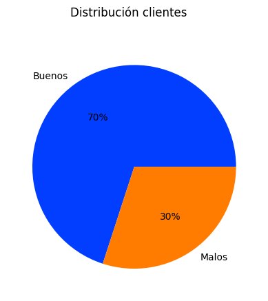

# Analisis y modelamiento de Scoring de clientes de Banco

## Audiencia

Participantes de BootCamp "Data Science" del ProfeAlejo

## Descripcion general

Este repositorio contiene el análisis de un dataset relacionado con el scoring de los clientes del banco XXX para evaluación del riesgo crediticio.   El objetivo es desarrollar y entrenar modelos de machine learning para predecir la solvencia de los clientes.

## Dataset

### Descripción

The dataset contiene información de historial crediticio y caracteristicas de los clientes con la cual se pretende realizar la predicción de si el cliente tiene solvencia o no para hacer crédito.  Incluye caracteristicas como edad, sexo, tiempo en empresa actual, tiempo de residencia, extranjero, tiene propiedad, ingresos, ahorros, plazo de credito. 

La variable a predecir es denominada como DEFAULT la cual tiene como valores 0 y 1 que indican si el cliente es bueno o malo.

### Fuente de datos

El archivo de datos fue suministrado por el banco XXXXX.

## Preprocesamiento de los datos

Se realiza preprocesamiento de datos, manejo de valores faltantes.  Se realiza conversión de variables categorías a enteros (int64) aplicando mapeo entre el diccionario de datos y el dataset.

## Feature Engineering

se realiza Feature Engineering para discretizar variables numéricas de tal forma que los valores estén clasificados en rangos lo cual facilita el entrenamiento de los modelos predictivos.

## Exploración de los datos

En el dataset suministrado se encuentra que el 70% de las solicitudes son clasificada como "Cliente bueno" y el 30% como "Cliente malo"

## Model Training

### Splitting the Data

Split the dataset into training and testing sets to evaluate the performance of the machine learning models.

### Model Selection

Choose suitable machine learning algorithms for credit scoring. Common models include logistic regression, decision trees, random forests, and gradient boosting.

### Model Training

Train the selected models on the training data and tune hyperparameters for better performance.

## Model Evaluation

Evaluate the trained models using the testing dataset. Metrics such as accuracy, precision, recall, and ROC-AUC can be used to assess the model's performance.

## Results

Present the results of the analysis, including model performance metrics, important features, and any insights gained from the analysis.

## Conclusion

Summarize the findings and conclusions drawn from the analysis. Discuss the practical implications and potential use of the trained models for credit scoring in a real-world scenario.

## Dependencies

List the dependencies required to run the analysis, including programming languages, libraries, and versions.

## Usage

Provide instructions on how to reproduce the analysis, train the models, and make predictions on new data.

## License

Specify the license under which this analysis is released.

---

Feel free to modify the content based on your specific dataset, analysis, and preferences.
